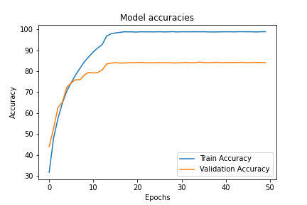
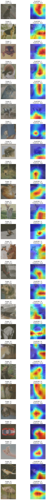

# 10 - Advanced Training

## Used LRFinder and Reduce LR on Plateau Optimizer

This notebook implements CIFAR10 classification using ResNet NN architecture using PyTorch,
and uses GradCAM analysis for model explanation  to explain which layer of model was activated for the give image

Here we use Data Augmentation implementusing [Albumentations](https://github.com/albumentations-team/albumentations) library

The results with using ResNet18 architecture with (2,2,2,2), that is, 4 residual blocks of size 2 each.
 
----
| Attribute | Value |
|:--- | :--- |
| Train Accuracy | 98.902 |
| Test Accuracy | 84.36 |
| Trained Parameter count   |11173962 |
| Dropout | 0.1 |
| Total Epochs | 50 |
| Batch Size | 64|
| LR using LRFinder | 0.1284|

----

The model uses:
* 3x3 Convolution
* Batch Normalization
* Max Pooling
* 4 X Residual networks of size 2 

To run 

You can install dependencies using  
`$ pip install -r req.txt`

### Grad CAM Images

