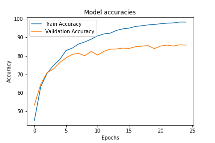
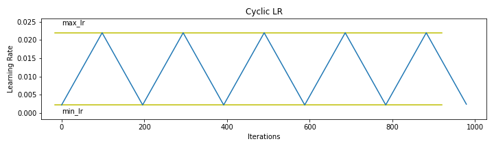

# 11 - Super Convergence

## Learning Rate Finder and OneCycle LR strategy
 
This notebook implements CIFAR10 classification using ResNet NN architecture using PyTorch,
and uses GradCAM analysis for model explanation  to explain which layer of model was activated for the give image

* Here we use Data Augmentation strategies  and implement using [Albumentations](https://github.com/albumentations-team/albumentations) library and
* Used One Cycle Learing Rate strategy to train model following learning rate finder to find LR where rate of change of losses is minimun (max negative)

The results with using ResNet18 architecture with (2,2,2,2), that is, 4 residual blocks of size 2 each.
 
----
| Attribute | Value |
|:--- | :--- |
| Train Accuracy | 98.356 |
| Test Accuracy | 86.05 |
| Trained Parameter count   |6573130 |
| Dropout | 0.1 |
| Total Epochs | 25 |
| Batch Size | 512|
| LR using LRFinder | 0.0220|

----

Cyclic LR amplitudes

The model uses:
* 3x3 Convolution
* Batch Normalization
* Max Pooling
* 4 X Residual networks of size 2 

To run 

You can install dependencies using  
`$ pip install -r req.txt`

### Grad CAM Images

