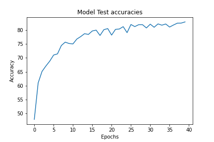

# Advanced Convolutions
This notebook implements CIFAR10 classification CNN using PyTorch 

----
| Attribute | Value |
|:--- | :--- |
| Test Accuracy | 80.28 |
| Trained Parameter count   |94218 |
| Dropout | 0.2 |
| Total Epochs | 40 |

----

The model uses:
* 3x3 Convolution
* 1x1 / Pointwise Convolution
* Dilated / Atrous Convolution
* Depthwise Separable Convolution
* Max Pooling

To run 

You can install dependencies using  
`$ pip install -r req.txt`

