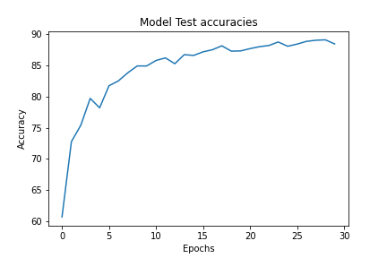

# Network Architectures
This notebook implements CIFAR10 classification using ResNet NN architecture using PyTorch 

The results with using ResNet18 architecture with (2,2,2,2), that is, 4 residual blocks of size 2 each.
 
----
| Attribute | Value |
|:--- | :--- |
| Test Accuracy | 89.08 |
| Trained Parameter count   |11173962 |
| Dropout | 0.1 |
| Total Epochs | 30 |
| Batch Size | 64|

----

The model uses:
* 3x3 Convolution
* Batch Normalization
* Max Pooling
* 4 X Residual networks of size 2 

To run 

You can install dependencies using  
`$ pip install -r req.txt`

