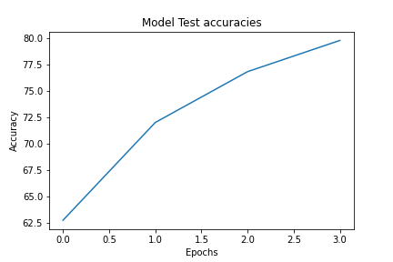

# Readme file for Quiz

This notebook implements CIFAR10 classification using ResNet NN architecture using PyTorch 

Here we use Data Augmentation implementusing [Albumentations](https://github.com/albumentations-team/albumentations) library

The results with using QuizDNN are as follows. The QuizDNN definition is in `model/QuizDNN.py` file
 
----
| Attribute | Value |
|:--- | :--- |
| Test Accuracy | 79.79 |
| Trained Parameter count   |299018 |
| Dropout | 0.1 |
| Total Epochs | 4 |
| Batch Size | 64|

----

The model uses:
* 3x3 Convolution
* Batch Normalization
* Max Pooling
* 4 X Residual networks of size 2 

To run 

You can install dependencies using  
`$ pip install -r req.txt`

